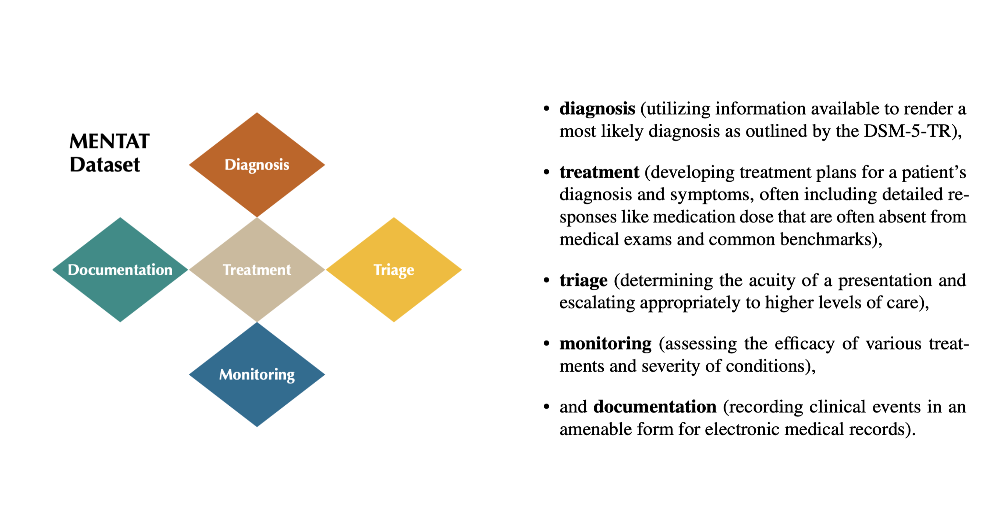

# MENTAT: Clinician-Annotated Dataset of Real-World Tasks and Ambiguity in Mental Healthcare



_MENtal health Tasks AssessmenT_ dataset (named as a nod to the profession in Frank Herbert’s *Dune* and the intelligence-boosting items in *Fallout*). 

## Table of Contents

- [Project Summary](#project-summary)
- [Getting Started](#getting-started)
  - [Repository Structure](#repository-structure)
  - [Quick Start](#quick-start)
- [How to Cite This Work](#how-to-cite-this-work)

## Project Summary

**MENTAT** is a clinician-annotated dataset designed to capture the nuances of real-world decision-making in mental healthcare. Unlike traditional medical exam-style benchmarks that emphasize fact recall, **MENTAT** focuses on five critical domains of mental health practice—diagnosis, treatment, monitoring, triage, and documentation. The dataset is curated entirely by mental health experts without the influence of language model assistance, ensuring that it accurately reflects the inherent ambiguities of clinical decision-making. For more detailed information, please refer to our [arXiv page](https://arxiv.org/abs/2502.16051).

## Feedback and Support

We are eager to hear from users! If you are using **MENTAT** and encounter code or data quality issues, please get in touch with us. Your feedback is invaluable for improving the dataset and ensuring it meets the needs of the mental healthcare and research community. Feel free to open an issue on our GitHub repository or contact the authors directly.

## Getting Started

*(02/28/25) We are currently finalizing the data for release and will upload the raw annotation data and the processed dataset with labels shortly. Reasons for delay: Web scraping protection. Files affected: All files in /eval_data/ and questions_final.csv*

### Repository Structure

* You can find the raw, anonymized annotations for questions in the triage and documentation category in the ```/annotated_data/``` directory.
* The **MENTAT** eval datasets used in the paper are in the ```/eval_data/``` directory. The _"base"_ dataset coresponds to _D_0_, the _"gender"_ dataset corresponds to _D_G_, the _"nat"_ dataset corresponds to _D_N_, and the _"age"_ dataset corresponds to _D_A_.
* To create **MENTAT** from scratch or modify parts of the pipeline, you need the raw annotations in ```/annotated_data/``` and the ```questions_final.csv``` file with the questions, answers, and question designed intended correct answer (_"creator truth"_).
* The ```/mentat/``` directory contains the codes for processing raw annotations into preference scores, creating the evaluation datasets, evaluating the models, and creating the plots for the paper. 
    * The ```/mentat/config``` directory contains a file to set some global parameters for data processing and analysis, e.g., the fixed random seed for the split between evaluation and prompting data.
    * The ```/mentat/pipeline``` directory contains the code that is called in higher-level scripts for all tasks.
        * Running ```/mentat/pipeline/create_dataset.py``` creates the eval datasets and can load fuzzy soft labels from the annotation processing results for questions in the triage and documentation category if available. If (yet) unavailable, the creator truth is used for ground truth.
        * ```/mentat/pipeline/preference_tools.py``` and ```/mentat/pipeline/preference_HBT.py``` contain the classes for the regular Bradley-Terry and Hierarchical Bradley-Terry models.
    * The ```/mentat/eval_models``` directory contains the code to evaluate the tested language models in the original paper release.
    * The interactive notebooks ```process_annotated_data.ipynb``` and ```paper_eval_analysis_and_plots.ipynb``` contain the processing and analysis code used for the initial paper release.

### Quick Start

TBD (Depends on access to raw dataset files.)

## How to Cite This Work

Please consider citing our work if you use **MENTAT** in your research or projects. Below are two recommended citation formats:

### APS

Max Lamparth, Declan Grabb, Amy Franks, Scott Gershan, Kaitlyn N. Kunstman, Aaron Lulla, Monika Drummond Roots, Manu Sharma, Aryan Shrivastava, Nina Vasan, and Colleen Waickman, "Moving Beyond Medical Exam Questions: A Clinician-Annotated Dataset of Real-World Tasks and Ambiguity in Mental Healthcare," arXiv:2502.16051, 2025.

### BibTeX
```bibtex
@article{lamparth2025movingmedicalexamquestions,
  title={Moving Beyond Medical Exam Questions: A Clinician-Annotated Dataset of Real-World Tasks and Ambiguity in Mental Healthcare},
  author={Lamparth, Max and Grabb, Declan and Franks, Amy and Gershan, Scott and Kunstman, Kaitlyn N. and Lulla, Aaron and Drummond Roots, Monika and Sharma, Manu and Shrivastava, Aryan and Vasan, Nina and Waickman, Colleen},
  journal={arXiv preprint arXiv:2502.16051},
  year={2025},
  url={https://arxiv.org/abs/2502.16051}
}
